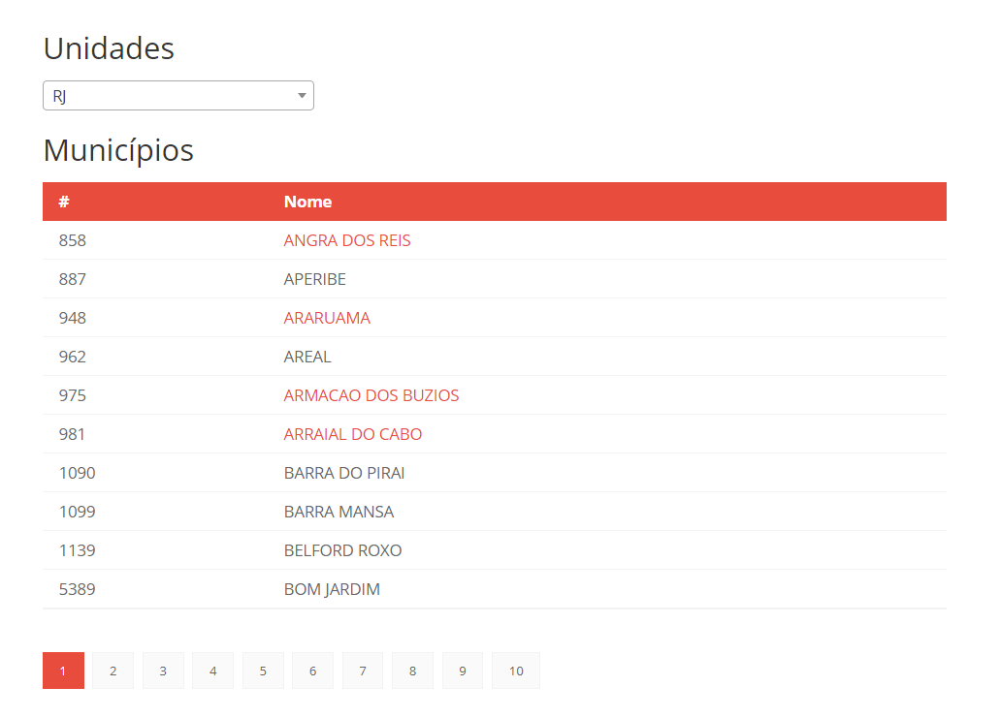

# Prova MG

Exercício proposto para prova da empresa fictícia MG, utilizando:

 - ASP.NET Core 3.1;
 - Swagger Tools;
 - XUnit (Testes de Integração);
 - Entity Framework Core (ORM);
 - MSSQL Server 2019 Linux (Database); 

### Galeria

###### API com Swagger UI

###### Home Page

###### Diagrama básico

## Instruções para execução

Em breve...
